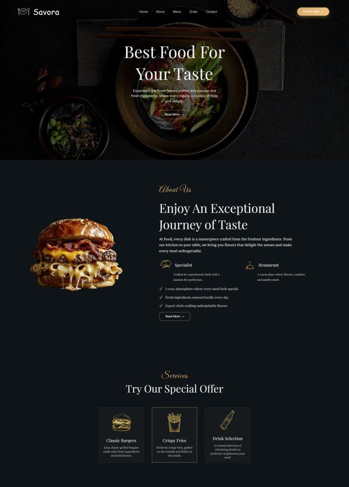
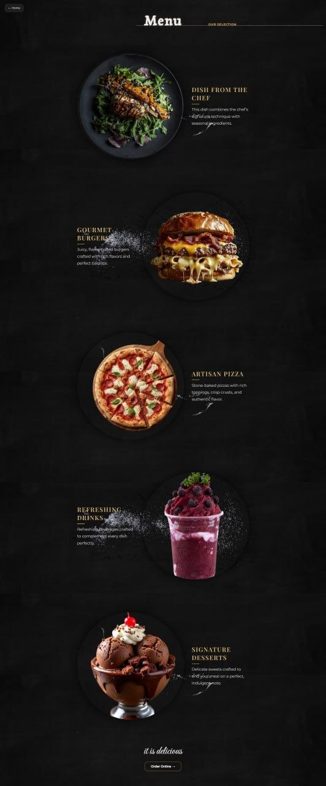
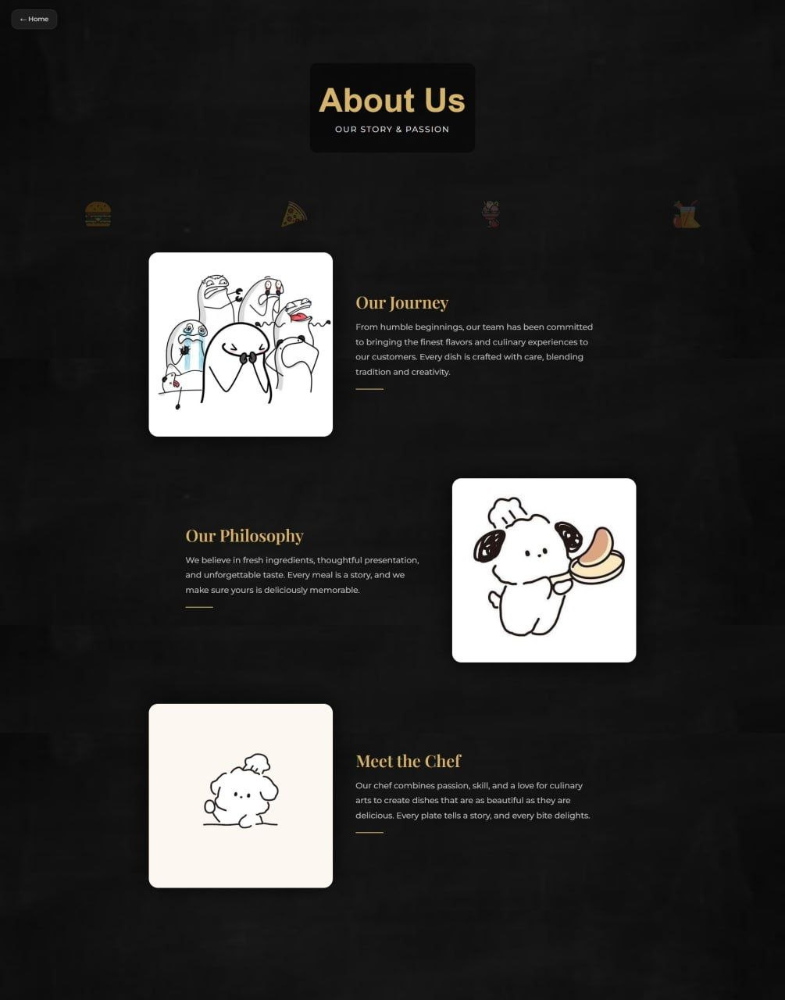
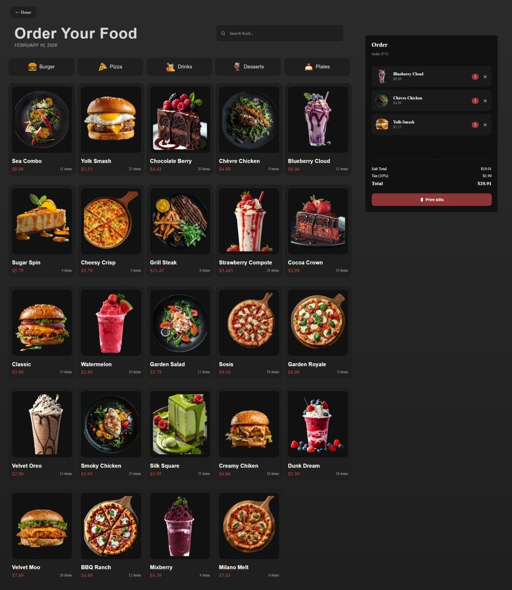
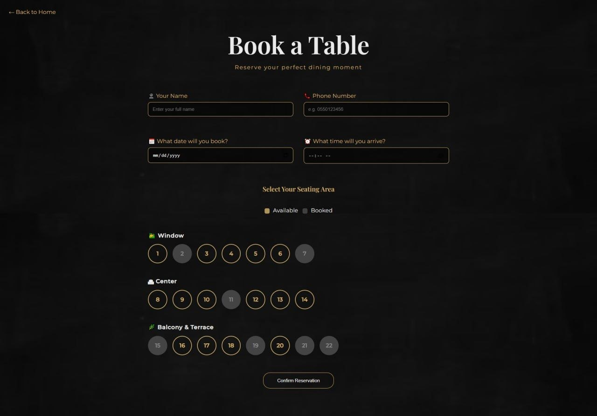
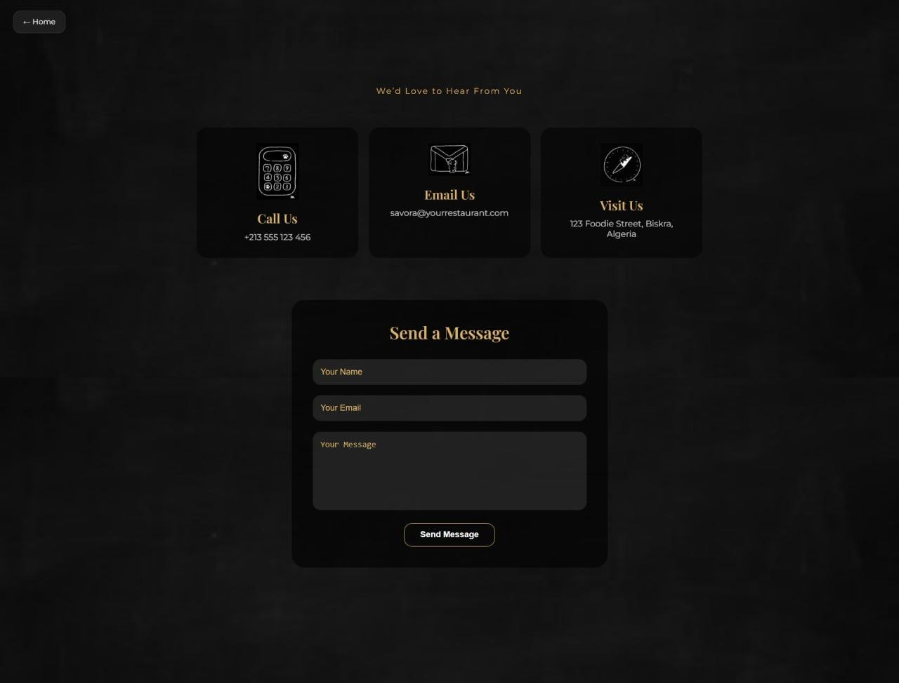
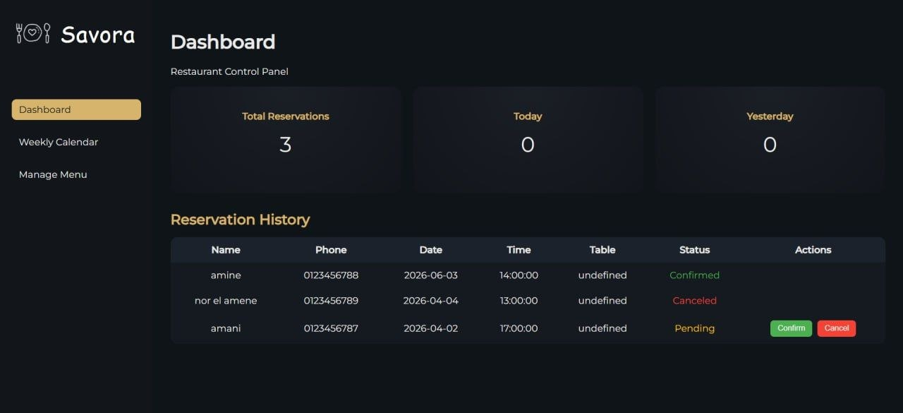
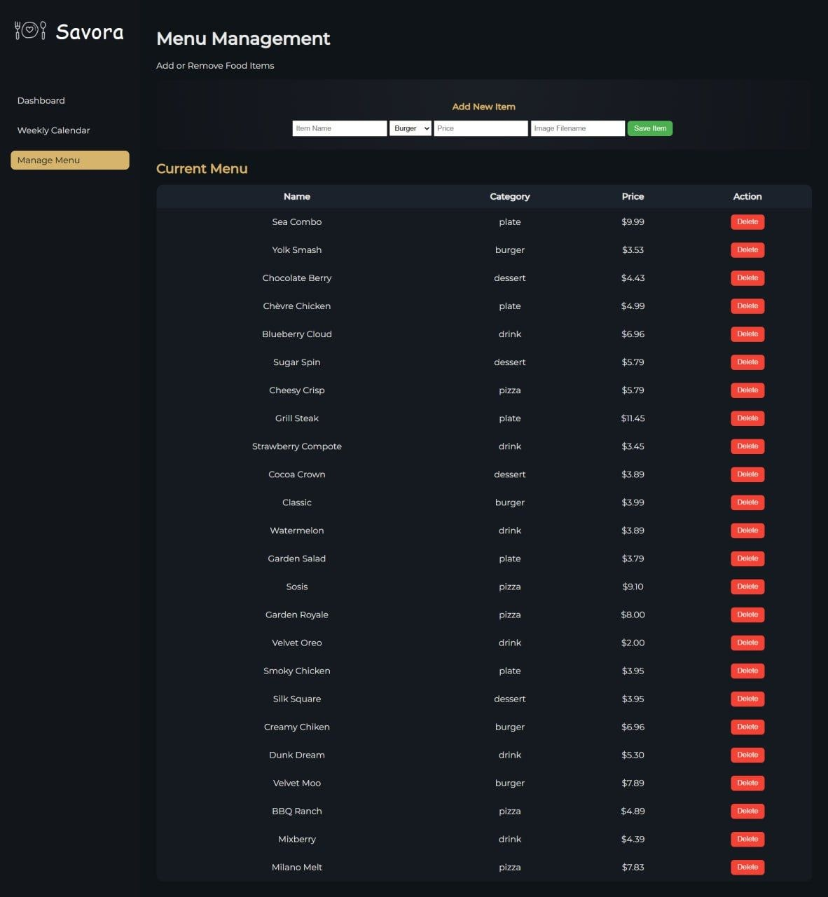

#  Savora — Restaurant Management & Ordering System

Savora is a full-stack restaurant website developed with **HTML, CSS, JavaScript, PHP, and MySQL**. The project combines a customer-facing restaurant website with online ordering, table reservations, and an administrative dashboard for managing restaurant data.

##  Features

###  Customer Features

*  Restaurant home page
*  Menu browsing
*  Menu search and category filtering
*  Online food ordering
*  Table reservation system
*  Order and bill generation
*  PDF bill generation
*  Responsive website interface
*  Interactive JavaScript animations and UI elements

###  Administration

*  Admin dashboard
*  Add new menu items
*  Manage menu items
*  Delete menu items
*  View and manage reservations
*  Manage restaurant orders
*  Database-backed restaurant management


##  Gallery & Screenshots

### Customer Interface
| Home Page | Menu Page |
| :---: | :---: |
| [cite: 5] | [cite: 2] |

| About Us | Order System |
| :---: | :---: |
| [cite: 3] | [cite: 4] |

| Table Booking | Contact Section |
| :---: | :---: |
| [cite: 6] | [cite: 7] |

### Administrative Dashboard
| Admin Dashboard | Menu Management |
| :---: | :---: |
| [cite: 1] | [cite: 8] |


##  Database

The application uses **MySQL** for storing and managing restaurant-related data.

The backend communicates with the database through PHP, allowing the application to handle:

* Menu items
* Customer orders
* Reservations
* Restaurant management data

Database credentials are loaded through environment variables rather than being stored directly in the repository.

##  Local Setup

### 1. Clone the repository

```bash
git clone git@github.com:Nor-El-Amene/Savora-Restaurant-Website.git
cd Savora-Restaurant-Website
```

### 2. Configure the database

Create a MySQL database for the application.

Then configure your environment variables using the provided example:

```text
.env.example
```

Create your local `.env` file:

```text
DB_HOST=localhost
DB_USER=root
DB_PASS=
DB_NAME=restaurant
DB_PORT=3307
```

> Adjust the values according to your local MySQL configuration.

### 3. Run the project

The project requires a PHP/MySQL development environment such as **XAMPP**.

Place the project inside the web server directory, for example:

```text
htdocs/Savora-Restaurant-Website
```

Start:

* Apache
* MySQL

Then open the project through your local server.

##  Security

Sensitive environment files are intentionally excluded from version control.

The repository includes:

```text
.env.example
```

while the actual:

```text
.env
```

file is excluded through `.gitignore`.

This prevents local database credentials from being published to the repository.

##  Project Purpose

Savora was developed as a practical full-stack web application combining **frontend development, backend programming, database management, and interactive web functionality** in a single project.

The project demonstrates experience with:

* Full-stack web development
* PHP backend development
* MySQL database integration
* REST-style PHP endpoints
* JavaScript-based UI interactions
* CRUD operations
* Form processing
* Restaurant order management
* Reservation management
* Administrative interfaces

##  Author

**Nor El Amene**

Biotechnology Engineer & Master's Graduate in Microbial Biotechnology

GitHub: [Nor-El-Amene](https://github.com/Nor-El-Amene)

---
